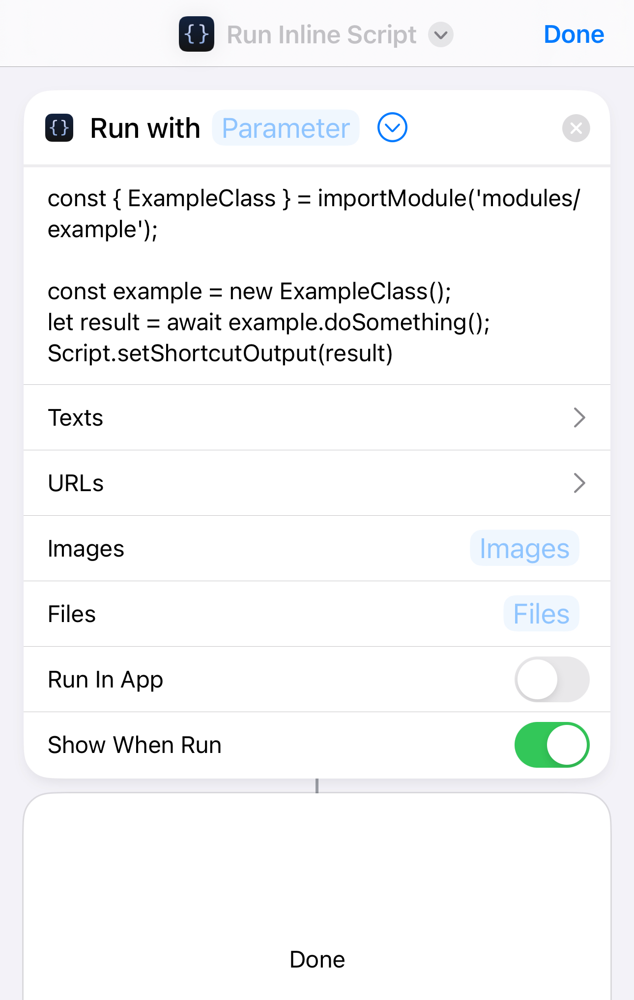

# Austin Rainwater's Scriptable Modules

## About

This repository contains some JavaScript and TypeScript modules I've written to be used with the 
[Scriptable](https://scriptable.app) app for iOS. 

The compiled modules are in the [dist](dist) folder. Their sources are in the [src](src) folder.

These scripts do not show up as standalone scripts in the Scriptable app, nor do they add TypeScript 
compatibility to Scriptable. However, they do abstract away a lot of complex logic, allowing me to
write simple scripts either in Scriptable or in Shortcuts inline scripts.

For example:

```javascript
const { ExampleClass } = importModule('modules/example');

const example = new ExampleClass();
let result = await example.doSomething();
Script.setShortcutOutput(result)
```



This takes advantage of how [importModule](https://docs.scriptable.app/importmodule/) works to find
modules in various locations.

## Usage

If you just want the modules as is, you can download the JavaScript files from the [dist](dist) folder. There are a few ways to copy them, but the easiest way would be to use Finder to copy the files from their downloaded location to the Scriptable folder on iCloud. See the [Scriptable documentation](https://docs.scriptable.app/importmodule/) for more information on where to put them and how to import them. 

Most modules have a `README.md` file with more information on how to use the APIs.

If you want to build from or edit the source, you will need to install [NodeJS](https://nodejs.org/en/). Then, you can run the following commands to install dependencies and build the modules:

```bash
git clone https://github.com/pacorain/scriptable-modules.git
cd scriptable-modules
npm install
npm run build
```

You can also run `npm run install-modules` to copy the modules to the Scriptable folder on your iCloud drive, inside a `modules` subdirectory. This is useful if you want to use the modules in Shortcuts inline scripts. This obviously requires that you are on a Mac and signed into iCloud Drive. 

You can also just have the modules built in a different folder by setting the `MODULE_OUTPUT_DIR` environment variable. This should theoretically work on Windows with iCloud Drive installed, but I haven't tested it. You could also output to a directory that you can drag to iCloud Drive in a web browser, I think.

There are also `build:watch` and `install-modules:watch` scripts that will watch for changes and rebuild the modules automatically, though there may be some latency between when the rebuilt modules are written to iCloud and when your iOS device sees the changes.

# Project Structure

## Module Configuration

This repo uses [rollup] to compile TypeScript modules into self-contained JavaScript files. This means each module is a single file.

Rollup [is configured](rollup.config.js) looks for modules in the [src](src) folder. Modules are identified by their `module.json` file; this file may contain an empty object (`{}`), but it must exist for the module to be compiled. Each module is then stored in a JavaScript file, by default in the [dist](dist) folder. Unless otherwise specified by the module config, the JavaScript file will have the same name as the module folder.

Using pure TypeScript in Scriptable is not possible because it mixes syntaxes of ES Modules and CommonJS, which is why the modules are compiled with JavaScript.

## Module Tests

I use [Jest][] for testing. Unit testing can be completed in the [test](test) folder. There is no enforced structure, but I try to follow the convention of having a {module_name}.spec.ts file for each module. Jest is configured to look for these files, and to run TypeScript tests, in the [jest.config.js](jest.config.js) file.

Scriptable is unique in that it runs JavaScript code in a non-standard environment, where some global variables are mapped directly to iOS APIs. Mocks for Scriptable are stored in [__mocks__/scriptable-ios.js]().